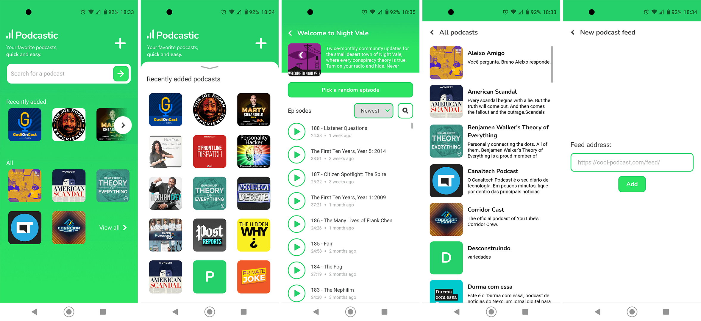
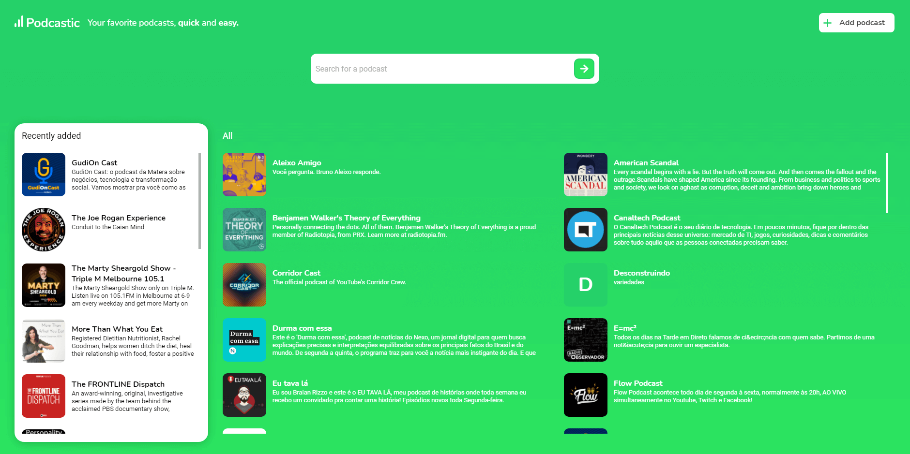
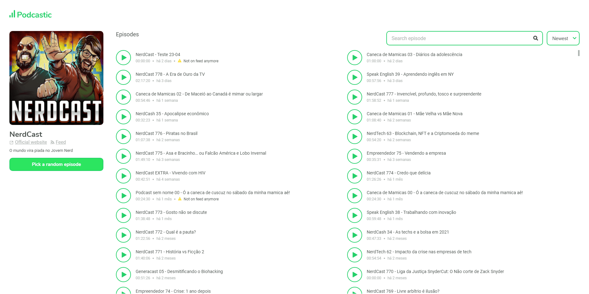

#

  

  

  

  

## Development

Prerequisite: [backend API](https://github.com/FusRoDah061/podcastic-backend)

- Clone the repository
- Install dependencies with `yarn` command
- Start the app with `yarn start`

## Deployment

Pushing to the `master` branch will trigger a new release at [Vercel](https://vercel.com/)
